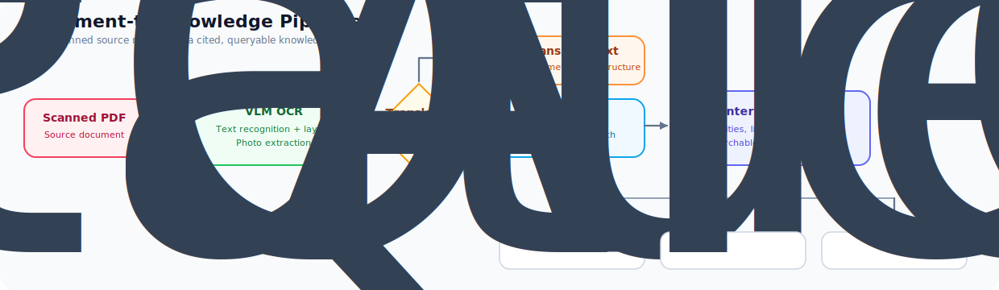

# okforge

**Turn your scanned documents into a private, verifiable knowledge base—all on your own hardware.**

Open Knowledge Forge (okforge) is a local-first system designed to create a structured Knowledge Base (KB) from scanned documents and make that data accessible to a locally hosted Large Language Model (LLM) via the Model Context Protocol (MCP).

Most ‘chat with your documents’ tools use a technique called RAG (Retrieval-Augmented Generation). Think of it like giving an AI a few random pages from a book instead of the whole chapter; because the AI is missing the full context, it often fills in the gaps with made-up information.

**okforge** takes a different approach: it organizes your sources into a structured, interlinked digital wiki *before* you ever ask a question. It generates document summaries, maps out key concepts, and extracts images—transforming raw scans into a curated library where every claim is backed by a real page number citation.

**Why this matters:**
*   **Trust through Verifiability:** You don't have to guess if the AI is right; you can see exactly which page of your original document the information came from.
*   **Privacy & Performance:** Because your data is pre-organized, you can use smaller, private AI models on your own computer without sacrificing quality. Your data never leaves your machine.
*   **True Ownership:** Your knowledge is saved as plain Markdown files (compatible with apps like Obsidian). You aren't locked into a proprietary system—you own your data forever.

The wiki follows the [Open Knowledge Format (OKF)](https://github.com/GoogleCloudPlatform/knowledge-catalog/blob/main/okf/SPEC.md), ensuring that your structured knowledge is portable, standardized, and readable by any modern text editor or MCP-compatible AI client.

## The Pipeline

  

### How it Works

1.  **Extraction:** okforge uses Vision-Language Models (VLM) to not only read the text (OCR) but also recognize and extract images, diagrams, and photos from your scans. If your documents are in another language, they can be translated during this stage.
2.  **Structuring (The "Forge"):** Instead of just saving a long text file, okforge "forges" the data into an interlinked wiki. It identifies key concepts, creates summaries, and ensures every piece of information is tagged with its original page number.
3.  **Interaction:** Once your knowledge base is built, you can use it however you like: browse it as a personal website, search it via command line, or connect it to a local AI model (via MCP) to chat with your data with high confidence.

## See a finished Knowledge Base

[**The Dade County Building Code of 1935**](https://okforge.github.io/dade-code-1935/) is a real-world example produced by **okforge** and created by [SRI Consultants](https://sriconsultants.net/), a Southeast Florida engineering firm that sponsored the deployment of the system.

While okforge is designed to make data accessible to an LLM via MCP, this browsable wiki allows you to inspect the structured Knowledge Base (KB) directly. It demonstrates what happens during the "Forge" stage: transforming raw scans into a verifiable digital asset.

For SRI Consultants, local-first ownership is critical; they use okforge to build KBs of proprietary processes and project information that must remain private and secure from frontier model providers like OpenAI or Anthropic. Because the **Dade County Building Code of 1935** is in the public domain, it serves as a perfect demonstration of the system's utility. In engineering practice—specifically when supporting work on historic buildings—the critical factor is the code the structure was originally permitted under. SRI uses this KB to reference the materials and methods used in historic Southeast Florida structures, featuring cross-document concept pages, full-text search, a graph view, and precise page number citations throughout.

## The okforge Ecosystem

The system consists of two core tools and a reference interface to demonstrate how they work together.

### Core Tools
These are primary Python libraries used to process documents and interact with your knowledge base. Both can be run directly from the command line or imported as modules into your own applications and scripts.

*   [**okforge-vision-ocr**](https://github.com/okforge/okforge-vision-ocr) $\rightarrow$ **The Digitizer**  
    The first step in the pipeline. It uses Vision AI to transcribe scans into clean text, crop out images and diagrams, and create the precise page maps required for real page number citations. 
    `pip install okforge-vision-ocr`

*   [**okforge**](https://github.com/okforge/okforge) $\rightarrow$ **The Knowledge Engine**  
    The heart of the system. It compiles digitized text into a structured, interlinked wiki and provides the interfaces (`chat`, `query`, and MCP server) to let you talk to your data via local AI models.
    `pip install okforge`

### Reference Implementation
*   [**okforge-webui**](https://github.com/okforge/okforge-webui) $\rightarrow$ **Local Dashboard (Example)**  
    This is a reference implementation demonstrating how the core tools can be combined into a usable application. It is designed for local, single-user use, allowing you to drop PDFs into an inbox and drive them through the pipeline via a browser interface. 

    *Note: As this is a demo for local setups, it does not include multi-user support or authentication.*
    
## Data-Driven Intelligence, Not Model-Baked Knowledge

Adding domain knowledge via fine-tuning or LoRAs is expensive, static, and opaque. **okforge** avoids this by keeping knowledge *out of the weights* and in structured, traceable pages that the model reads at inference. 

This approach is made possible by a new generation of highly capable small models. These models are not just larger in context window, but fundamentally "smarter"—they can reason over complex, unfamiliar data they weren't trained on with remarkable precision. Consequently, a 7–30B model can answer based on pre-synthesized curated pages rather than relying on flawed internal memory. This ensures that updating the KB is as simple as adding a document, switching models is seamless, and every response remains strictly verifiable.

## Modular by Design

The three repositories are components of a pipeline, not a monolithic bundle—each layer provides standalone value:

*   **Just want PDFs as clean Markdown?** Use [`okforge-vision-ocr`](https://github.com/okforge/okforge-vision-ocr). It converts scanned pages to Markdown with extracted photos and page maps. Because it produces standardized Markdown, its output can be used directly in any other downstream tool or ingested into traditional RAG systems.
*   **Already have Markdown documents?** Use [`okforge`](https://github.com/okforge/okforge). It compiles existing text directly into a citation-backed wiki—no OCR step or web UI necessary.
*   **Want the full point-and-click pipeline?** Deploy [`okforge-webui`](https://github.com/okforge/okforge-webui) on top for an integrated inbox, job queue, wiki browser, and one-button publishing.

## Bring your own chat client

okforge is not a chat app, and it ships without a vector database by design. Instead, it attaches to your preferred client (Open WebUI, llama.cpp, Page Assist, Hermes Agent, or any MCP-compatible host) as an **MCP server**.

This allows for a powerful **hybrid approach**: you can use your client's built-in Vector RAG for broad, semantic discovery while using okforge for precision and verification. By avoiding the embedding step for its own core logic, okforge uses a "locate-then-read" approach. The MCP tools provide full-text search over the wiki (`grep_wiki` / `search`), allowing the model to find and read curated, page-cited documents directly. 

Furthermore, a Knowledge Base in this system is a *subject collection*, not a wrapper around a single file. Many different documents can be combined into one KB; as new material lands, concept and entity pages accrete sources over time. The web UI's MCP server allows the model to search across every KB it hosts simultaneously.

## Local-first, for real

For many users, keeping data local is not a preference—it is a requirement. Ethical, legal, and proprietary constraints mean that sensitive business processes simply cannot be sent to a third-party cloud API. Everything in this suite is tuned for the case where the LLM resides on **your** hardware.

### Hardware Reality
The shift toward strong open multimodal models (such as the Qwen3.6-27B class) finally makes a fully local scan-to-wiki pipeline practical—provided the GPU has sufficient VRAM for both the model and a generous context window. 

This suite is developed and run daily on RTX 3090, RTX 5090, and RTX 6000 Pro Blackwell hosts; a single 24 GB card is a proven, real-world baseline, not a theoretical hope. To ensure stability on consumer hardware:
*   **Serial Ingest:** The job queue is strictly serial to avoid choking single-slot llama.cpp hosts.
*   **Zero Dependencies:** There is no telemetry, no account system, and no SaaS dependency in the path.
*   **Scaling:** More VRAM allows the host to serve multiple slots, and because queries are read-only, they parallelize across these slots so several clients can work the same KBs at once.

### Architectural Flexibility
None of the components need to share a machine. okforge itself does not require a GPU; it only needs network access to an LLM endpoint. 

You can deploy a modest server between your desktop and your GPU machine to host the KBs, the web UI, and the MCP server for your entire LAN. Any OpenAI-compatible endpoint works—whether that is a local llama.cpp/vLLM instance or a hosted provider like OpenRouter.

## Start here

Ready to build your own verifiable knowledge base? 

*   **For developers:** Read the engine's [GETTING_STARTED](https://github.com/okforge/okforge/blob/main/GETTING_STARTED.md) guide.
*   **For a turnkey experience:** Clone [okforge-webui](https://github.com/okforge/okforge-webui) to launch the full point-and-click pipeline.
*   **Prefer to be walked through it?** Hand [this install prompt](https://github.com/okforge/okforge-webui/blob/main/docs/INSTALL_PROMPT.md) to a coding agent and it will set the suite up with you interactively.

---

### Project Heritage & Credits

The **okforge** engine began as a hard fork of [VectifyAI/OpenKB](https://github.com/VectifyAI/OpenKB). It diverges deliberately to prioritize self-hosted operation, scanned-document workflows, and strict OKF conformance over SaaS integration. For those who prefer a managed service and for whom local hosting is not a primary requirement, VectifyAI’s offering is an excellent choice.

The system follows Google's **Open Knowledge Format (OKF)**—an open specification that standardizes [Andrej Karpathy's "LLM Wiki" concept](https://gist.github.com/karpathy/442a6bf555914893e9891c11519de94f), ensuring that structured knowledge remains portable and readable by any modern AI client.

Special thanks to [SRI Consultants](https://sriconsultants.net/) for sponsoring the development of this project, contributing critical architectural ideas, and serving as its first real-world user.

**Licensing:** Apache-2.0 (engine) / MIT (vision-ocr, webui).
